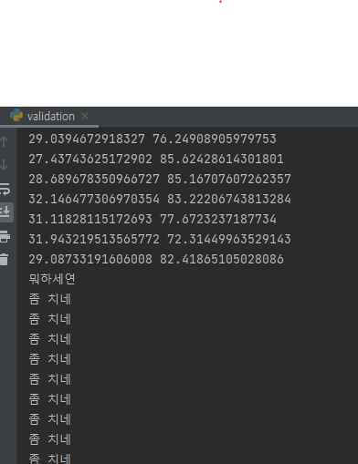

# muscle-loss-prevention
전공특화설계 프로젝트. '근손실'을 예방하기 위한 스마트 트레이너
 
------------------------------------------  

### 설명
  
+ data, Data Analysis.ipynb 파일은 볼 필요 없습니다!
#### 1. exercise_count.py 파일에 대해
이 파일에는 우리가 기존에 알아본 오픈소스에 대한 내용이 들어있습니다.  
운동의 횟수를 카운팅 해주는 것이고, 영준형의 전처리 과정이 여기에 적용된다는 식입니다.  
모델학습 부분을 주석처리 해놓고, 불러오는 부분부터 실행되게끔 해놓았습니다.  
추가 데이터셋과 전처리로 구성이 되면 그때 계속 모델학습을 하면 됩니다. 해당 파일 이름은 model.h5입니다.  
  
#### 2. pose_estimation.py 파일에 대해
이 파일에서는 미디어파이프를 통한 카운팅이 사실은 됩니다.  
하지만 제가 직접 해보니 정확성이 떨어져서 카운팅은 위의 exercise_count 파일 내용으로 진행하면 됩니다.  
그리고 제가 sklearn.cluster의 KMeans를 이용해 한 가지 학습을 해놓았어요.  
이는 팔굽혀펴기에 대한 학습모델로, 몸이 끝까지 내려갔을 때의 팔꿈치와 어깨에 대한 각도를 클러스터링으로 학습해 놓은 것입니다.  
팔꿈치와 어깨 각도를 묶어서 군집화를 한 다음, 이것에서 많이 벗어나면 1. 괜찮으면 0의 형태로 라벨링이 되도록 한 것입니다.  
학습에 이용한 동영상은 https://www.youtube.com/watch?v=rek8fuV8LRY&t=163s&ab_channel=DeSLun%EB%8D%B0%EC%8A%A4%EB%9F%B0 입니다. 이 영상은 pushup_video.mp4로 제가 만들어놓은 그것입니다.  
그리고 이 학습 모델은 model.pkl 파일로 따로 나와 있을 것입니다.

#### 3. validation.py 파일에 대해
위 pose_estimation을 검증한 파일입니다.  
해당 파일을 돌렸더니 결과는 다음과 같이 나왔어요.

</img>
